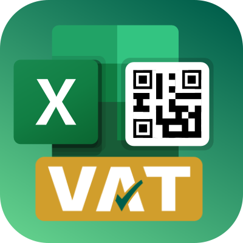
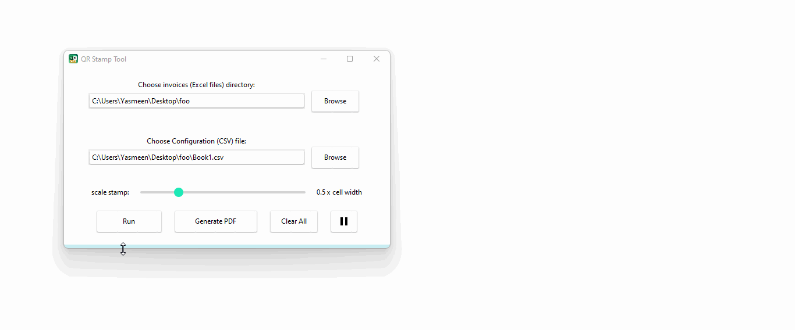
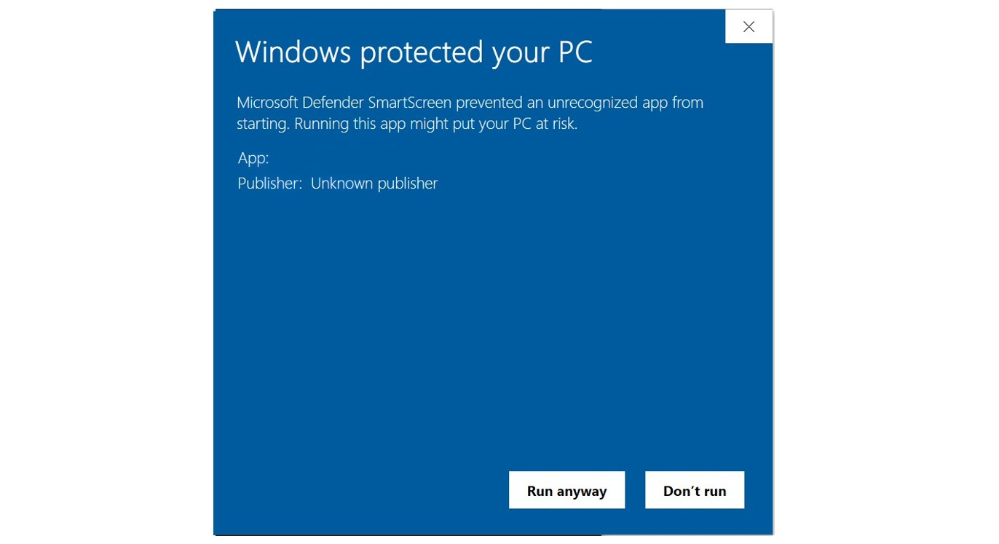

# StampQR

  

This small desktop application is for stamping Excel invoices with a QR code adhering to ZATCA (Zakat, Tax, and Customs Authority) of Saudi Arabia Government. It's helpful to be used for stamping a batch of invoices at once. With this app you can do:

1. Stamp all Excel files (the invoices).
2. Export all Excel files in a given directory as PDF.
3. Clear previously add QR codes from all Excel files in a given directory.

## How to use

  

For stamping, the app needs a configuration file (`.csv`) with the following **exact** format:

| Company      | VAT NUM    | DATE     | VAT        | TOTAL        | INV                                     | QR                         |
| ------------ | ---------- | -------- | ---------- | ------------ | --------------------------------------- | -------------------------- |
| company name | vat number | dd-mm-yy | VAT amount | total amount | associated excel file without extension | Cell ID where to put stamp |

**Example**:

| Company | VAT NUM         | DATE     | VAT        | TOTAL        | INV        | QR   |
| ------- | --------------- | -------- | ---------- | ------------ | ---------- | ---- |
| Warshat | 310092208700543 | 10-04-23 | 20560.56   | 1594913.58   | INVOICE_01 | E47  |
| Warshat | 310092208700543 | 10-04-23 | 1230.5     | 25943913.58  | INVOICE_02 | E40  |
| Apple   | 345092208700543 | 10-04-23 | 1130000.15 | 351594913.58 | INVOICE_03 | H20  |

## Installation

StampQR is only compatible with windows as it needs Excel (no support for MacOS), and currently only released for Windows 11.

- Download the [latest release](https://github.com/hasauino/stamp-qr/releases/latest/download/StampQR_win11_64.exe).
- Run the installer.
- Make sure you have Excel installed as well
- use the app :rocket:

:warning: Windows will show Unknown Publisher warning, click on <kbd>Run Anyway</kbd>

